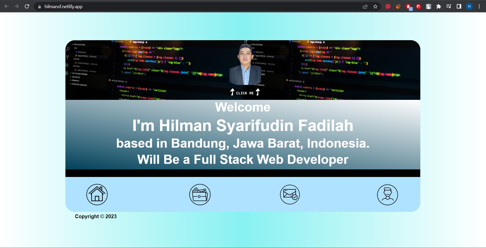
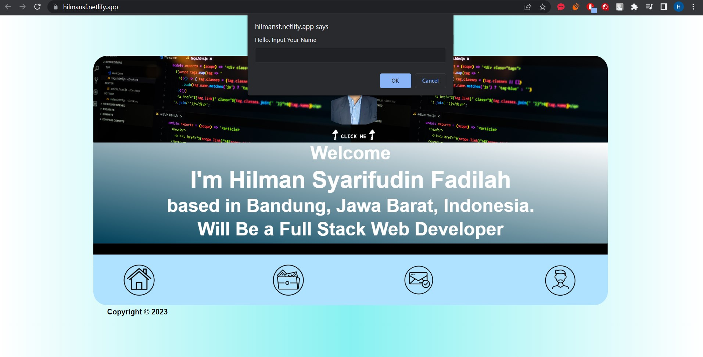
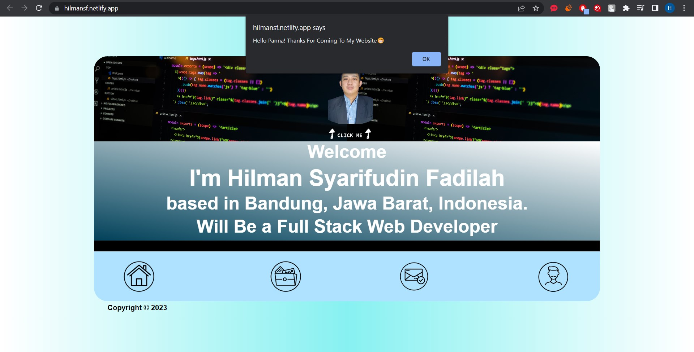

# Personal Website
Hello there. This is My First Personal Website, and it is Alpha Version of My Personal Website. The html isn't semantic but I'll fix it in the Beta Version (hopefully) hehehe. thanks for coming guys. and here's a little documentation about my Personal Website.
               

## Features

- Button on My Photo

## Tech

Aplikasi ini dibangun dengan menggunakan :

- [DILLINGER](https://dillinger.io/) - Dillinger is an online cloud based HTML5 filled Markdown Editor. Sync with Dropbox, Github, Google Drive or OneDrive. Convert HTML to Markdown.
- [Visual Studio Code](https://code.visualstudio.com/) - Visual Studio Code is a code editor redefined and optimized for building and debugging modern web and cloud applications.
- [HTML](https://html.com/) - HTML is the standard markup language for Web pages.
- [CSS](https://www.w3schools.com/css/) - CSS is the language we use to style an HTML document.
- [JavaScript](https://www.javascript.com/) - JavaScript is the programming language of the Web.
- [Netlify](https://www.netlify.com/) - Netlify is a platform for web developers to host their sites in the cloud without managing any servers in the back-end where application logic and database works. 
- [Adobe Photoshop](https://www.adobe.com/id_id/products/photoshop.html) - Adobe Photoshop is a raster graphics editor developed and published by Adobe Inc. for Windows and macOS the software has become the most used tool for professional digital art, especially in raster graphics editing

## Requirement
##-HTMLClick Me and Input Nameck Me and Input Nament
-CSS##-HTMLClick Me and Input Nameck Me and Input Nament
-JavaScript (ES6)

## Website View

And I have some animation here

## Credit

Hilman Syarifudin F
https://hilmansf.netlify.app/
